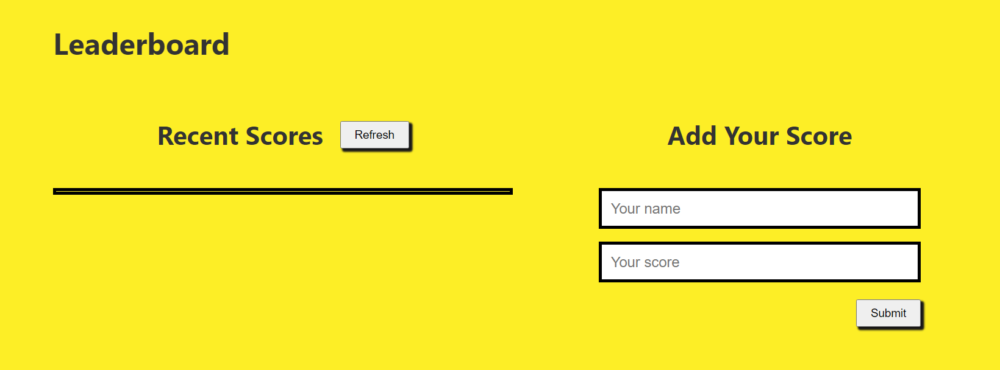

# Leaderboard
The leaderboard website displays scores submitted by different players. It also allows you to submit your score. All data is preserved thanks to the external Leaderboard API service.

# Built with
- Webpack
- JavaScript
- CSS

# Features
- Adding a new task
- Removing a task
- Storing data in the local storage

## Live Demo
- [Live Demo Link](https://olipliche.github.io/Leaderboard/dist/)

## Getting started
To get a local copy of this project, follow these simple steps
- Clone this clone this repo by typing: git clone `https://github.com/OLIPLICHE/Leaderboard.git`, on your local terminal
- Type cd `https://github.com/OLIPLICHE/Leaderboard` to access the project on the terminal

## To make the project run in your local machine
- You will need to set up or install webpack in your machine. Open the link bellow for set up
- `https://webpack.js.org/guides/getting-started/#basic-setup`

## Installation of Packages.Json
 Run the code bellow inside your terminal to install Packages.Json in your local machine.
- npm install --save-dev stylelint stylelint-config-standard
- {
  "extends": "stylelint-config-standard"
}
- npx stylelint "**/*.css"

### Prerequisites
- Text editor
- Git
- Html
- CSS
- Js
- webpack

## Authors
👤 **Olipliche Mavoungou Paka**
- GitHub: [@githubhandle](https://github.com/OLIPLICHE)
- LinkedIn: [LinkedIn](https://www.linkedin.com/in/olipliche-paka-mavoungou/)

## 🤝⭐️ Contributing

Contributions, issues, and feature requests are welcome!

Feel free to check the [issues page](https://github.com/OLIPLICHE/Leaderboard/issues).

## Show your support

Give a ⭐️ if you like this project!

## Acknowledgement
- Hat tip to anyone whose code was used
- Inspiration
## 📝 License

This project is [MIT](./MIT.md) licensed.
